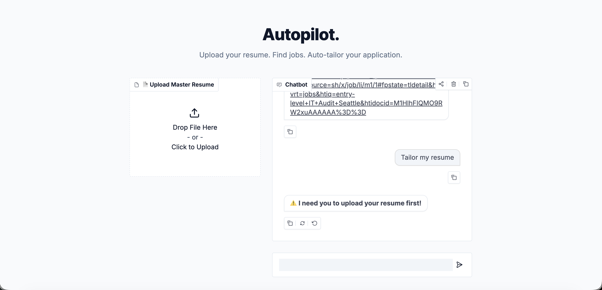
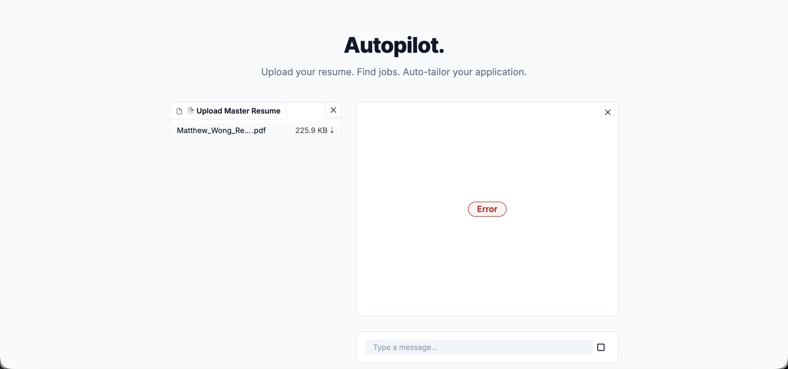

# 🚀 Autopilot: AI Job Application Suite

**Live Demo:** https://huggingface.co/spaces/mjwmatthewwong/ai-job-hunter

## Overview
Autopilot is an agentic AI chatbot designed to streamline the job application process for job seekers. By integrating live job board searches with document parsing and LangChain routing logic, it automatically finds relevant listings, tailors uploaded resumes to match Applicant Tracking Systems (ATS), and drafts customized cover letters. 

## The Problem
The modern job hunt is often described as an "ATS black hole." Job seekers send out hundreds of generic resumes that get automatically filtered out because they lack specific keywords from the job description. Manually tailoring a resume and writing a unique cover letter for every single application is incredibly time-consuming and exhausting. I wanted to build a tool that automates this "keyword alignment" phase, drastically reducing application fatigue while keeping the human in the loop to verify the final output.

## How It Works
The bot operates using a LangChain-powered routing agent that determines the user's intent based on their chat message and conversation history. It routes to four primary tools:
1. **Job Search API (SerpApi):** Queries Google Jobs for live listings and extracts the full background job description.
2. **Document Reader:** Uses `pypdf` and `python-docx` to parse user-uploaded master resumes into memory.
3. **Resume Tailor Engine:** An LLM chain that compares the resume to the job description and suggests 3 factual "micro-edits" without hallucinating experience.
4. **Cover Letter Generator:** Synthesizes the job description and resume into a targeted, 3-paragraph professional cover letter.

**Routing Logic:** A classifier prompt categorizes the input (e.g., `SEARCH`, `TAILOR`, `FULL_PACKAGE`). If the user asks for the "Full Package", the bot chains the tools together: fetching the job, reading the resume, tailoring the bullets, and writing the letter in one seamless sequence. It also utilizes a hidden `gr.State()` memory block so it can remember the job description across multiple conversational turns.

## Key Findings / What I Learned
Building this project exposed me to several real-world software engineering hurdles, particularly regarding API limitations and state management. Initially, I used the Adzuna job API, but quickly learned that aggregators intentionally hide full job descriptions to force user clicks. Because my LLM only had a 200-character snippet to work with, it started hallucinating resume edits. I had to pivot to SerpApi (Google Jobs) to scrape the raw, full-text descriptions to ground the AI's suggestions. 

Additionally, dealing with Gradio's stateless nature was challenging. Early iterations of the bot kept "forgetting" the job description between the search phase and the tailor phase. I had to re-engineer the LangChain router to pass a hidden session state dictionary back and forth so the bot could maintain conversational memory. Finally, I ran into frequent `429 RESOURCE_EXHAUSTED` errors because chaining the LLM tools together fired off too many requests to the Gemini Free Tier at once. I solved this by implementing `time.sleep()` delays to respect API rate limits, and by writing safe-extraction functions to prevent Python from crashing when Gemini returned unexpected JSON lists.

## Sample Conversations & Error Handling

Below are visual logs of the development process, showcasing how the bot handles edge cases, memory lapses, and API limits.

**1. Handling Missing Context (Guardrails)**
The bot is programmed to intercept tailoring requests if a master resume hasn't been uploaded yet, preventing the LLM from processing empty data.

**2. The Stateless Memory Limitation**
Before implementing the `gr.State()` session memory, the bot would immediately forget the job description after searching. When asked to tailor a resume based on the "first job found," it failed to understand the context of the previous turn.

**3. Hitting API Rate Limits**
When I first built the `FULL_PACKAGE` intent, the bot executed three heavy LLM tasks (Classification, Tailoring, Cover Letter) simultaneously. This triggered a `429 RESOURCE_EXHAUSTED` crash from Google. I resolved this by adding a 15-second sleep timer to throttle the requests.

*(Note: Successful interactions are logged dynamically in the `chat_logs.csv` file available for download in the live app interface).*

## How to Run
1. Clone this repository to your local machine.
2. Install the required dependencies: 
   `pip install langchain langchain-google-genai gradio requests pypdf python-docx`
3. Secure your API keys: Create a free account at [Google AI Studio](https://aistudio.google.com/) for Gemini, and [SerpApi](https://serpapi.com/) for Google Jobs.
4. Set your environment variables:
   - `GOOGLE_API_KEY` = your_gemini_key
   - `SERPAPI_API_KEY` = your_serpapi_key
   *(If deploying to Hugging Face Spaces, add these in the Space Settings -> Variables and Secrets menu).*
5. Run the application: `python app.py`
6. The Gradio interface will automatically launch in your local browser.

## Who Would Care
Job seekers trying to break out of the ATS black hole would find this immensely useful for reducing application fatigue. By automating the tedious process of keyword matching, candidates can apply to more jobs with higher-quality materials. Additionally, career coaches and university career centers could use a tool like this to demonstrate to students exactly how ATS tailoring works and why specific keyword alignment is critical for modern recruitment software.
